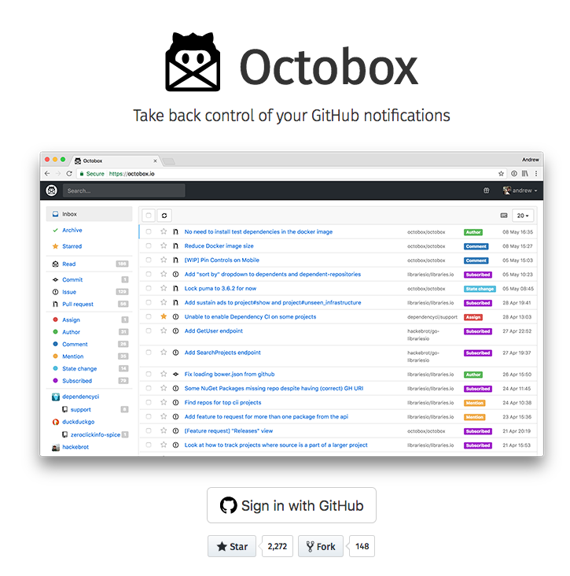

[Octobox][octobox] is for sure one of my favourite tools in my GitHub centred developer workflow.
It is incredible for GitHub notification management which allows me to ignore all the hundreds of GitHub notification emails I get daily.

Octobox is a Ruby-on-Rails application and can be used as SaaS at [octobox.io](https://octobox.io) or installed and used separately.
Running Octobox in an own account is especially appealing for privacy reasons and for advanced features which are not enabled in the hosted version (like periodic background fetching or more information per notification).

This post shows how Octobox can be ported to the free "starter" tier of [OpenShift Online][openshift-online].

<!-- more -->

## Application setup

An Octobox installation consists of three parts:

* Octobox itself, a Rails application
* Redis as an ephemeral cache, used as a session store
* Postgresql as the backend database

Naturally, this would lead to three services.
However, as I'm not striving for an HA setup and the sake of simplicity, I decided to combine Octobox and Redis in a single pod.
Since a combined lifecycle for Octobox and Redis is a reasonable, fair choice, this reduces the number of OpenShift resource objects considerably.

As persistent store for Postgres, we use a plain `PersistentVolume` which is good enough for our low-footprint database requirements.

## Docker Images

To get an application onto OpenShift, you first need to package all parts of your application into Docker images which eventually become container during runtime.

There are some [restrictions][openshift-image-guidelines] for Docker images to be usable on OpenShift.
The most important one is that all containers run under a random UID, which is part of the Unix group `root`.
This restriction has the consequence that all directories and files to which the application process want to write should belong to group `root` and must be group writable.

Octobox already is distributed as a [Docker image][octobox-dockerfile] and has recently be [updated][octobox-dockerfile-chgrp] to be OpenShift compatible.
The [Postgres image][postgres-imagestream] is directly picked up from an OpenShift provided ImageStream, so there is no issue at all.
The [Redis Imagee][redis-image] is also already prepared for OpenShift
However, when using Redis from this image in an ephemeral mode (so not using persistence) there is a subtle issue which prevents starting the Pod:
As the Dockerfile declares a [VOLUME][redis-dockerfile-volume] and even though in our setup we don't need it, we **have** to declare a volume in the Pod definition anyway.
Otherwise, you end up with a cryptic error message in the OpenShift console (like `can't create volume ...`).
An `emptyDir` volume as perfectly good enough for this.

## Template

To install the application an [OpenShift Template][openshift-template] has been created.
It contains the following objects

* `DeploymentConfig`s for "Octobox with Redis" and "Postgres"
* `Service`s for Octobox and Postgres
* `PersistentVolumeClaim` for Postgres

A route for accessing the app is created later on the OpenShift console.
Please refer to these [installation instructions][octobox-openshift-installation] for more details how to use this templats.

## OpenShift Online Starter

[OpenShift Online Starter][openshift-online-starter] is the free tier of OpenShift online which is very useful for learning OpenShift concept and get one's feet wet.
However, it has some quite restrictive resource limitations:

* 1 GB Memory
* 1 GB Storage

This budget is good enough for small applications like Octobox, but if you need more horsepower than you can easily upgrade to OpenShift Online Pro.

The challenge is now to distribute the three parts (Octobox, Postgres, Redis) over these 1 GB.
As Octobox as rails application is quite a memory hog, we want to dedicate as much memory as possible to it.
For Postgres, we do not need much Memory at all, so 50 to 100 MB is good enough.
The same for Redis as an initial guess.
We can always tune this later if we found out that our initial guess a wrong.

Ok, let's start with:

* 875 MB Octobox
* 50 MB Redis
* 75 MB Postgres

When trying out these limits, I quickly found out that this doesn't work.
The reason is that OpenShift Online has a **minimum** size for a container which is 100 MB.
Also, you can't choose [requests and limits][kubernetes-requests-limits] freely, but there is a fixed ratio of 50% to calculate the `request` from a given `limit` (the `request` specified is always ignored).
This fact not only means that you get a [_Burstable_][kubernetes-qos-class] QoS class, but also that you **have** to specify 200 MB as `limit` to get at least 100 MB `request` to exceed the required minimum.

So we end up with:

* 600 MB Octobox
* 200 MB Redis
* 200 MB Postgres

Apparently, this is not optimal, but that's how it works for OpenShift Online Starter tier (and probably also the Pro Tier).
For other OpenShift cluster it, of course, depends on the setup of this specific cluster.
We could put Redis and Octobox in the same container, and start two processes in the container.
This change would free up another 150 MB for Octobox but is ugly design.
So we won't do it ;-)

## tl;dr

Porting an application to OpenShift is not difficult.
Especially the free [OpenShift Online Starter][openshift-online] is very appealing for such experiments.
The challenges are mostly around creating proper Docker images and getting resource limits right.
As a result, you get a decent running and managed installation.

For the full installation instructions, please refer to the OpenShift specific Octobox [installation instructions][octobox-openshift-installation] (_still pending as PR but should be available in the upstream repo soon_)

* Every declared `VOLUME` in the Docker image must have a volume mounted on in OpenShift online
* Resource limits: Minimum 256Mb, ratio requests/limit is fixed (so, always 'Burstable')

[openshift-online]: https://www.openshift.com/pricing/index.html
[octobox]: https://github.com/octobox/octobox
[openshift-image-guidelines]: https://docs.openshift.org/latest/creating_images/guidelines.html
[octobox-dockerfile]: https://github.com/octobox/octobox/blob/bd6c2cbc4745363240482f36210509830d0c4bc1/Dockerfile
[otxobox-dockerfile-chgrp]: https://github.com/octobox/octobox/blob/bd6c2cbc4745363240482f36210509830d0c4bc1/Dockerfile#L25-L26
[redis-image]: https://hub.docker.com/r/centos/redis-32-centos7/
[postgres-imagestream]: https://docs.openshift.com/container-platform/3.7/using_images/db_images/postgresql.html
[redis-dockerfile-volume]: https://github.com/sclorg/redis-container/blob/7689bf310dc29f363f0cf7e0e74a457cda5a3f6e/3.2/Dockerfile#L73
[kubernetes-qos-class]: https://medium.com/google-cloud/quality-of-service-class-qos-in-kubernetes-bb76a89eb2c6
[kubernetes-requests-limits]: https://kubernetes.io/docs/concepts/configuration/manage-compute-resources-container/
[openshift-template]: https://github.com/rhuss/octobox/blob/5f08e8b222ebb820f2a9b892ece7e768fd87a974/openshift-template.yml
[openshift-online-starter]: https://www.openshift.com/pricing/index.html
[octobox-openshift-installation]: https://github.com/rhuss/octobox/blob/7785c12b73b15397c5cefa82cbe7837466ac101a/openshift/OPENSHIFT_INSTALLATION.md
