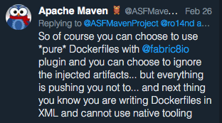

As you might know, one of my Open Source babies is the one and only [fabric8io/docker-maven-plugin][d-m-p] (d-m-p).
If you already use this Maven plugin, you know, that it is super powerful and flexible to configure.
This flexibility comes at a price so that the configuration can become quite complicated.
Now, if you only want to _build_ Docker images with Maven, I have good news:
Since 0.25.1 d-m-p supports a zero XML configuration mode, the so-called [Simple Dockerfile Build][simple-dockerfile-mode][^1] mode.


<!-- more -->

The idea of this mode started with a twitter discussion:





And actually, it's true: If all that you want is to build a single Docker image from a Dockerfile, then the initial configuration is indeed too complex.

d-m-p already supports [plain Dockerfiles][dockerfile-mode] for quite some time, and that even for multiple images.
However, you still have to reference those Dockerfiles in the XML configuration of the plugin.

Since 0.25.1 you can now use the so-called [Simple Dockerfile Build][simple-dockerfile-mode] mode (kudos go to Rohan Kumar for the initial [implementation][initial-pr]).
All you have to do is to add d-m-p to your `pom.xml` and add a Dockerfile.
The smallest possible Maven project for creating a Docker image consists of this `pom.xml`

```xml
<project>
  <modelVersion>4.0.0</modelVersion>

  <groupId>fabric8io</groupId>
  <artifactId>smallest</artifactId>
  <version>1-SNAPSHOT</version>

  <build>
    <plugins>
      <plugin>
        <groupId>io.fabric8</groupId>
        <artifactId>docker-maven-plugin</artifactId>
        <version>0.25.1</version>
      </plugin>
    </plugins>
  </build>
</project>
```

and a `Dockerfile` alongside this pom:

```dockerfile
FROM busybox
CMD ["echo", "Hello", "world!"]
```

This image does not really much.
With `mvn docker:build` you can build it, with `docker run fabric8/smallest` you can test it.
Or use `mvn docker:run` so that you even don't have to provide the image name.

A more realistic Dockerfile could look like


```dockerfile
FROM openjdk:jre

ARG jar=target/app-1.0.0-SNAPSHOT.jar

ADD $jar /app.jar
CMD java -cp /app.jar HelloWorld
```

where we define `jar` as [build arg][docker-build-arg] in the Dockerfile but also as property in the `pom.xml`:

```xml
<properties>
  <jar>${project.build.directory}/${project.build.finalName}.jar</jar>
</properties>
```

You can use Maven properties in the Dockerfile which get automatically replaced by `docker:build` when creating the image.
But you can use that Dockerfile also without Maven with `docker build .`
You can't use Maven properties with `.` directly as dots are not allowed in Docker build args, therefore we use an extra property.
However, a maven-less usage probably does not make much sense when you don't also build the artefacts.
The full example can be found in the [dmp GitHub repo][simple-dockerfile-example].

If you can forgo Docker build args you can use predefined Maven properties directly:

```dockerfile
FROM openjdk:jre
ADD  ${project.build.directory}/${project.build.finalName}.jar /app.jar
CMD java -cp /app.jar HelloWorld
```

The image name is auto-generated, but you can set this name also by yourself by setting the property `docker.name` (and you can even use [placeholders][dmp-placeholders] within this name)

You can even start the container with `mvn docker:run` although without any additional configuration (e.g. like port mappings).
Also, you can `docker:push` the image.

You can still configure certain aspects like authentication or binding d-m-p goals to default lifecycle phases.
Using this mode is very similar to the functionality offered by [spotify/dockerfile-maven][spotify-dockerfile-maven].

If you need more horsepower, you can gradually expand on this simple setup.
Features which are waiting to be discovered are

* Setup of multiple images for running integration tests
* Custom networks and volumes for your tests
* Using docker-compose files for running the containers directly from the plugin
* Exporting the Docker image as an archive
* Watch docker containers and restarted them when the code changes
* All can be configured via properties, too and since with the latest versions, you can mix it with XML configuration.
* ....

If you are interested in even more to find out, then please have a look at the [reference manual][dmp-manual].

I'm curious what you think about this new mode.
Please use the comments below if you want to leave some feedback.
In fact, there are concrete plans for d-m-p to include the [generators][fmp-generator] from the fabric8-maven-plugin functionality of autodetecting the tech stacks used for creating opinionated Docker images.

[d-m-p]: https://github.com/fabric8io/docker-maven-plugin/
[dmp-manual]: https://dmp.fabric8.io/
[simple-dockerfile-mode]: https://dmp.fabric8.io/#simple-dockerfile-build
[dockerfile-mode]: https://dmp.fabric8.io/#external-dockerfile
[initial-pr]: https://github.com/fabric8io/docker-maven-plugin/pull/969
[spotify-dockerfile-maven]: https://github.com/spotify/dockerfile-maven
[dmp-placeholders]: https://dmp.fabric8.io/#image-name-placeholders
[simple-dockerfile-example]: https://github.com/fabric8io/docker-maven-plugin/tree/master/samples/zero-config
[fmp-generator]: https://maven.fabric8.io/#generators
[docker-build-arg]: https://docs.docker.com/engine/reference/commandline/build/#set-build-time-variables---build-arg
[^1]: Currently the fabric8 family is moving their DNS business, so it _might_ be that you hit some "invalide cert" issues in your browser when following the doc links. You can add a security exception here, but please verify first that the "wrong" cert points to GitHub, as the documentation is served from GitHub Pages. Sorry for the inconvenience.
